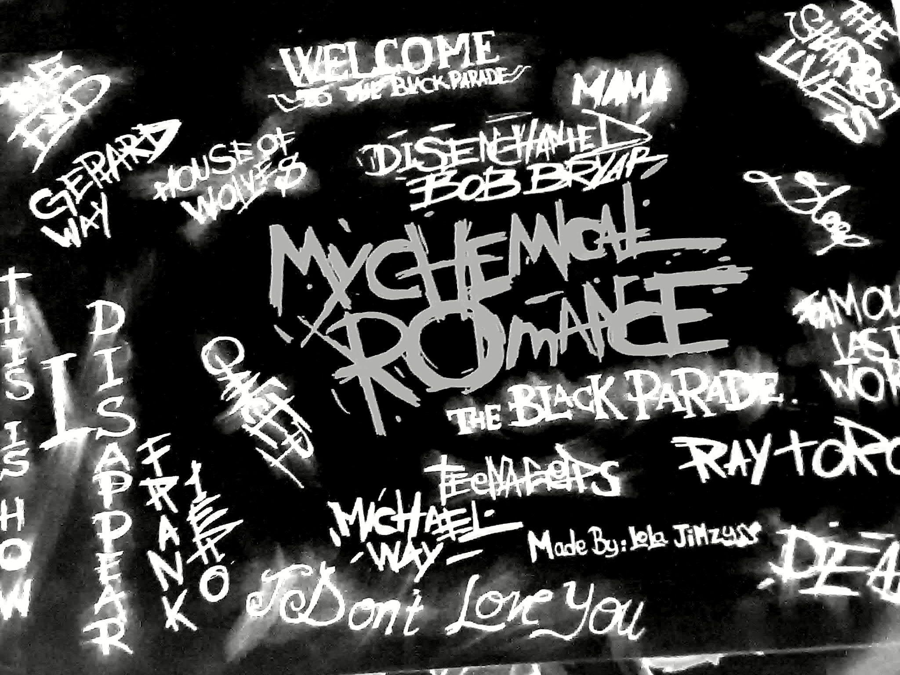

## Hi everyone my name is Rafael but u can call me El 👋

<!--
**rfl07/rfl07** is a ✨ _special_ ✨ repository because its `README.md` (this file) appears on your GitHub profile.

Here are some ideas to get you started:

- 🔭 I’m currently working on ...
- 🌱 I’m currently learning ...
- 👯 I’m looking to collaborate on ...
- 🤔 I’m looking for help with ...
- 💬 Ask me about ...
- 📫 How to reach me: ...
- 😄 Pronouns: ...
- ⚡ Fun fact: ...
-->

- 🔭 I’m currently studying at **SMKN 68**
- 🌱 I’m currently learning about **Programming Languages**
- 🤔 I’m looking for some help with **Data Processing**
- 🎵 i'm like listening music

##### My Skills

 

 

#### Programming Languages I'm Currently Learning

##### My Sosical Media
 

